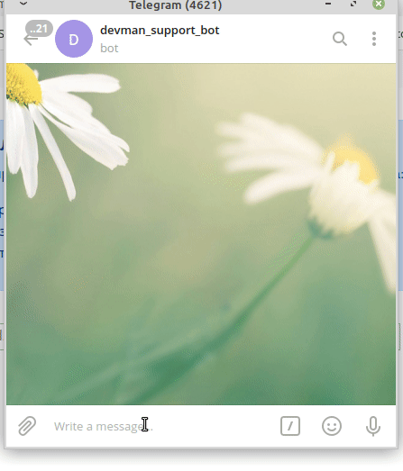
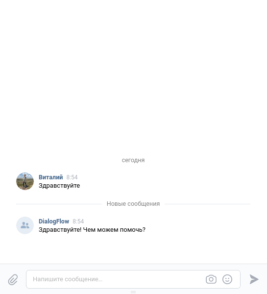

## Google "Dialogflow" и telegram bot и vk bot

Google сервис dialogflow интегрирован с telegram и vk 

## Подготовка проекта

- Создайте группу вконтакте для получения токена -> [vk API](https://vk.com/dev/bots_docs).
- Выполните описанные условия для создания Google проекта [google cloud](https://cloud.google.com/dialogflow/docs/quick/api) и создайте [dialogflow agent](https://cloud.google.com/dialogflow/docs/quick/api).
- Получите все токены/ключи для заполнения `.env` файла.
```
TELEGRAM_TOKEN=<Токен от tg бота (получить у BotFather)> 
CHAT_ID=<Ваш id чата в tg (получить у userinfobot)>
PROJECT_ID=<ID проекта от Google (console.cloud.google.com)>
VK_TOKEN=<Токен от группы ВК>
LOG_CHAT_ID=<tg токен от чат бота с логами>
GOOGLE_APPLICATION_CREDENTIALS=<путь до файла key.json с GOOGLE_APPLICATION_CREDENTIALS>
```

## Запуск

Для запуска телеграм бота используйте следующую команду:
```
python telegram_bot.py
```
Пример работы бота:



Для запуска вконтакте бота используйте следующую команду:
```
python vk_bot.py 
```
Пример работы бота:


#### Для обучения dialogflow агента предусмотрен скрипт training.py

Для запуска выполните команду:
```
python training.py
```
Пример json файла:

```{
    "Устройство на работу": {
        "questions": [
            "Как устроиться к вам на работу?",
            "Как устроиться к вам?",
            "Как работать у вас?",
            "Хочу работать у вас",
            "Возможно-ли устроиться к вам?",
            "Можно-ли мне поработать у вас?",
            "Хочу работать редактором у вас"
        ],
        "answer": "Если вы хотите устроиться к нам, напишите на почту game-of-verbs@gmail.com мини-эссе о себе и прикрепите ваше портфолио."
    },  ...
```
